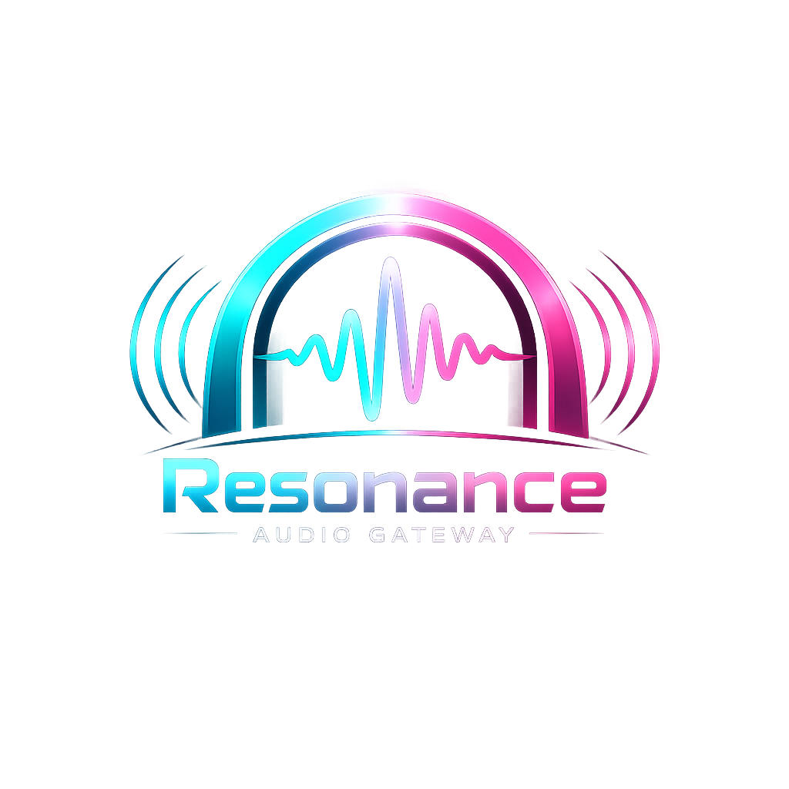

# Resonance
A self-hosted central audio orchestrator designed to run entirely in your homelab. It bridges the gap between raw machine-learning pipelines (Speech-to-Text/Text-to-Speech) and low-power smart home hardware.
<br>


---


## 💡 What is Resonance?

**Resonance** is a self-hosted central smart speaker audio orchestrator designed to run entirely locally in your homelab. It bridges the gap between raw machine-learning pipelines (Speech-to-Text/Text-to-Speech) and low-power smart home audio hardware. 

Instead of configuring complex multi-container stacks and writing YAML configurations for every satellite microphone, Resonance acts as a smart central audio gateway. It automatically provisions your smart speaker devices, processes incoming acoustic streams to reduce background noise centrally, and arbitrates which room you are speaking from based on relative signal metrics.

## 🛠️ Core Features

* **Zero-Touch Satellite Provisioning:** Flash a minimal base image onto an `ESP32-S3` or `Raspberry Pi Zero 2 W`. Once powered on, Resonance detects it over the local network and hooks it directly into your audio pipeline via a minimalist audiphile web UI.
* **Centralized Acoustic Signal Processing (DSP):** Avoid burning cycles on low-power microcontrollers. Satellites stream raw audio, while Resonance filters room reverb, echo, and background HVAC hum at the container level.
* **Wake-Word Arbitration:** If multiple satellites hear a command in an open floor plan, Resonance analyzes audio latency and RSSI data to determine your exact physical location, executing the command in the target room while silencing the others.
* **Native Home Assistant Integration:** Automatically exposes detected satellites, wake events, and state attributes directly to Home Assistant via an integrated MQTT component or native Home Assistant API integration.

---

## 🛠️ Installation

### Prerequisites

- **Docker** & **Docker Compose** (because why else do you want this project?)

### 🚀 Quick Start (Docker Compose)

```yaml
services:
  resonance:
    image: z3r0-g/resonance:latest
    container_name: resonance
    restart: unless-stopped
    ports:
      - "8888:8888" # Web UI Dashboard
      - "5555:5555" # Satellite Ingress Streaming API
    environment:
      - TZ=America/Los_Angeles
      - LOG_LEVEL=info
      - MQTT_BROKER=mqtt://192.168.1.50:1883
      - MQTT_USER=resonance_user
      - MQTT_PASSWORD=secure_password
    volumes:
      - /data/appdata/resonance/config:/config
      - /data/appdata/resonance/profiles:/profiles
    devices:
      - /dev/snd:/dev/snd # Optional hardware audio passthrough if needed
```

---
